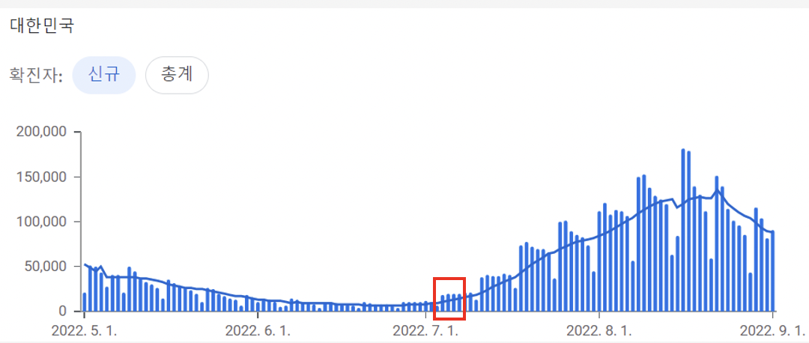
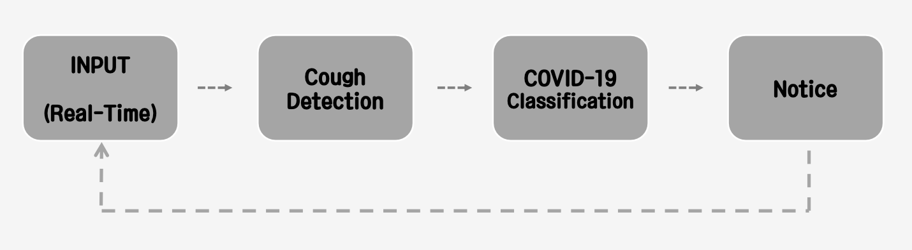
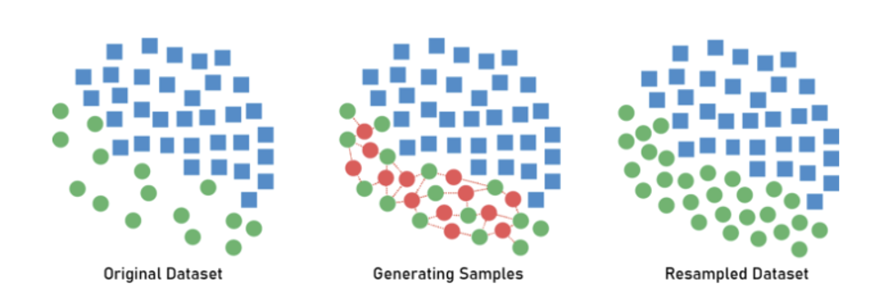
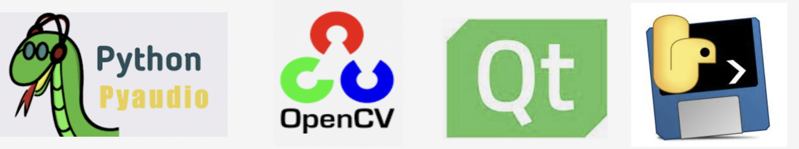
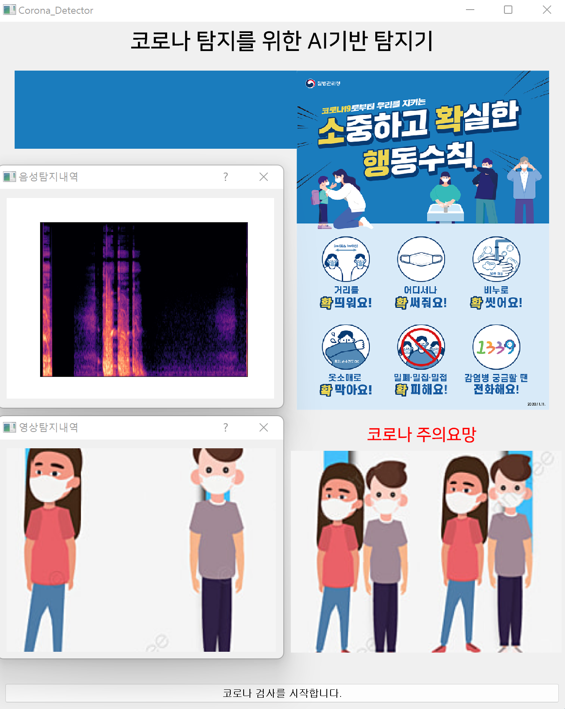
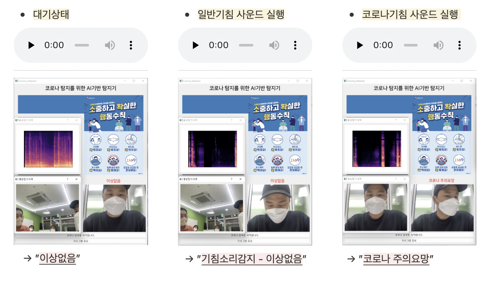
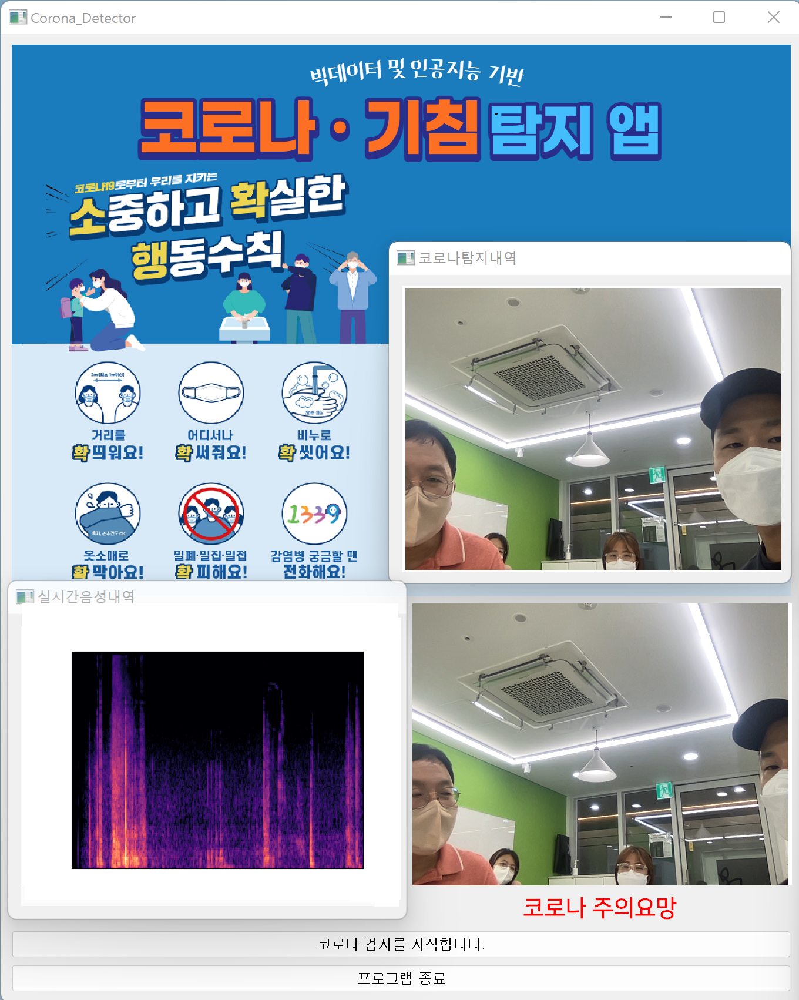

# Sesac_Project_COVID-19_Cough_Recognition(Real-Time Application)

&nbsp;
## 🎈 __목차__
### 1. Subject
* 추진배경
* 기대효과
### 2. Information
* 음성데이터에 대하여
* 추진과정
### 3. Datasets
* 데이터 수집
* 데이터 전처리
### 4. Modeling
* 학습모델 선정
* 모델 성능평가
### 5. Service
* 프로토타입 구현
* 애플리케이션 제작
### 6. Conclusion
* 개선방향
* 데모시현

   


&nbsp;
## 🎈 __Subject__
### 1. 추진배경
* 코로나19 재유행에 따라 기침소리를 이용해 실시간으로 감염여부를 판단하고 함
* 이 프로젝트를 시작한 2022년 07월부터 일일 확진자 수가 증가세를 보임에 따라 주제선정의 공감대 형성
* 또한 엘리베이터 등 밀집지역에서의 코로나 확산방지를 위해 기침소리 데이터분석 및 모델구축을 연구해보고자 함

</br>@Covid19 일별 확진자 동향 : (출처 - Google News 검색)
</br>
</br>
</br>
### 2. 기대효과
* 감염자의 접근이 쉽고 폐쇄적인 공간인 엘리베이터에 활용하여 의심환자 발생 시 빠른 대응
   * 의심환자의 경우, 선별진료소 방문 등의 조치
   * 관리자의 경우, 의심환자 발생 공간(엘리베이터)에 방역 실시
      

   


&nbsp;
## 🎈 __Information__
### 1. 음성데이터에 대하여
* Melspectogram : 음성데이터의 주파수 단위를 멜 단위(Mel Unit)으로 바꾸어 표현한 스펙트럼
* MFCC: 음성데이터를 특징 벡터화 해주는 알고리즘
</br>

### 2. 추진과정
* 데이터 수집
   * 일반 기침소리, 코로나환자 기침소리 수집
* 데이터 전처리
   * Feature 추출 및 Spectogram 생성
   * SMOTE(Over Sampling)
* 기침 감지
   * 학습모델 생성 및 Binary Classfication(Cough)
* COVID19 분류
   * 학습모델 생성 및 Binary Classfication(COVID)
* 프로토타입 제작


</br>@COVID19 Cough Recognition Process
   
   
   
   
&nbsp;
## 🎈 __Datasets__
### 1. 데이터 수집
* 다양한 기침 및 코로나 데이터셋 수집, 기타 소리분류를 위한 추가 데이터셋 수집


<table>
  <tr>
    <th>제공</th>
    <th>설명</th>
    <th>사용 부분</th>
  </tr>
  <tr>
    <td>ESC-50</td>
    <td>일상의 소리 50종류를 5초 동안 녹음한 소리 파일</td>
    <td rowspan="3"> Cough Detection</td>
  </tr>
  <tr>
    <td>AI-HUB</td>
    <td>자연 및 인공적 발생 비언어적 음성 데이터</td>
  </tr>
  <tr>
    <td>COUGHVID</td>
    <td>연령, 성별, 거주지 및 COVID-19 상태를 포함한 음성 데이터</td>
  </tr>
  <tr>
    <td>Coswara Heavy Data</td>
    <td>Coivd-19 감염자의 기침소리가 포함된 기침 데이터</td>
    <td rowspan="2"> Covid-19 Classification</td>
  </tr>
  <tr>
    <td>VIRUFY(DACON)</td>
    <td>Covid-19 검사자들의 기침소리로 확진자의 소리가 포함됨</td>
  </tr>
</table>


</br>

### 2. 데이터 전처리
* SMOTE(Synthtic Minority Oversampling Technique)
   * 주제 특성상 양성데이터의 수가 적어 각각의 데이터 개수를 비슷하게 맞춰주기 위해 음성데이터는 Under sampling, 양성데이터는 Over sampling 진행

</br>@데이터의 개수가 적은 클래스의  표본을 가져운 뒤, 임의로 추가하는 오버샘플링 방식

     
     
 &nbsp;
## 🎈 __Modeling__: Cough Detection
### 1. 데이터 처리\
(1) 5초 단위로 Cut & Padding\
(2) ResNet 학습을 위해 Melspectogram을 ImageNet 사이즈로  Crop & Resize

### 2. 학습 및 모델 선정
* 이미지 분류에 주로 사용되는 ResNet으로 Transfer learning.
* 5-fold Cross Validation 적용하여 과적합 방지.
* 멜스펙토그램의 특성에 맞도록 weight 제외하고 구조만 가져옴. ```pretrained=False```로 두고, weight를 계속 업데이트.
* 성능 지표 민감도를 우선 순위로 두고, 나머지 세 지표도 고려하여 모델 선정.


|모형\지표|Accuracy|Precision|Sensitivity|F1-score|
|---|---|---|---|---|
|ResNet18|0.855|0.826|0.854|0.840|
|ResNet50-fc2|0.880|0.865|0.892|0.878|
|ResNet50-fc2|0.845|0.802|0.829|0.815|
   
민감도를 포함한 네가지 성능 지표 모두 우수한 "ResNet50 - 2 fully-connected layers' 모델로 선정.


&nbsp;
## 🎈 __Modeling__
### 1. 학습모델 선정
* 데이터 선행처리 : 동일한 수준의 음성데이터 처리(5초) 
* Custom CNN을 통한 MFCC 데이터 분류
   * Zero crossing rate, rmse, spectral cetroid 등 총 46개의 feature 사용
* ResNet50을 통한 Melspectogram 이미지 분류   
   * CNN 구조를 가졌으며, 많은 layer를 활용하여 깊은 네트워크 구조를 가짐
   * Vanishing Gradient 문제를 해결하기 위해 Residual Block을 이용
   * 2015년 ILSVRC에서 우승한 알고리즘
</br>
</br>
</br>
</br>

### 2. 성능평가


|구분|내용|
|---|---|
|Custom CNN을 통한 MFCC Feature 분류|정확도 60%|
|ResNet50을 통한 Melspectogram Feature 분류|정확도 55% ~ 60%|
|MFCC, MelSpectrogram으로 추출한 feature 분류|정확도 55% ~ 60%|


      

   

&nbsp;
## 🎈 __Service__
### 1. 프로토타입 구현
* 각종 라이브러리를 이용한 음성 및 영상 데이터 입력 


|구분|내용|
|---|---|
|Pyaudio|마이크를 통한 음성데이터 입력 및 사운드파일 저장|
|OpenCV|웹캠을 통한 영상데이터 입력 및 이미지파일 저장|
|Librosa|음성데이터의 특징 변수 추출|
|Torch|Pytorch를 활용한 학습모델 적용|


</br>@주요 라이브러리
</br>
</br>
</br>
### 2. 애플리케이션 제작
* PyQt5를 이용한 GUI 형태의 애플리케이션 구현
   * Qdesigner를 이용하여 전체적인 UI 디자인을 간단하게 진행 
   * Qthread를 이용하여 기본 앱에 실시간 입력 쓰레드의 효율적인 운영
   * Qdesigner를 이용하여 전체적인 UI 디자인을 간단하게 진행 
 
 
 
|구분|내용|
|---|---|
|기본앱|대쉬보드, 코로나탐지결과 등|
|윈도우1|실시간 음성 데이터 입력 및 처리 쓰레드 운영|
|윈도우2|실시간 영상 데이터 입력 및 처리 쓰레드 운영|
|비고|음성 데이터 입력과 동시에 학습모델 처리 진행|


</br>


* Pyinstaller를 이용한 실행파일 제작
   * Python 애플리케이션과 모든 종속 항목을 단일 패키지로 묶어 주는 라이브러리
   * Windows OS 기반 Python 미설치 환경에서도 운영가능하도록 exe 파일형태로 제작
   * (*) 여기서 문제가 되었던 부분은 하나의 파일로 만들기 위해 pyinstaller 명령어에  ```--onefile```옵션을 다는 것을 추천하지 않겠다. 라이브러리 누락으로 실행의 오류가 걸릴 가능성이 높다.
   * (*) 또한 librosa 라이브러리의 경우, librosa/util/example_data가 누락되었다는 오류가 뜨므로, ```--add-data [파이썬 위치]/Lib/site-packages/librosa/util/example_data;librosa/util/example_data```옵션을 추가하여 파일을 수동으로 복사해주는 것이 좋다.


|구분|이상없음|기침감지|코로나감지|
|---|---|---|---|
|사진(앱)||||


@어플리케이션 구조 
</br>
</br>
</br>
 


      

   

&nbsp;
## 🎈 __Conclusion__
### 1. 데모시현
* 주요기능
   * 실시간 음성데이터 학습모델 분석
   * 그래프 제공을 통한 기침 탐지 확인 
   * 영상 제공을 통한 코로나 탐지 확인
 
[](https://youtu.be/4_Df2c615xk)</br>@데모시현 장면
</br>
</br>
</br>
### 2. 개선방향
* 성능 향상
   * 데이터 변형 및 잡음 제거를 통한 데이터 구축
   * COVID19 분류 시 60% -> 80% 이상의 정확도 기대
   * 

* 활용도 확장
   * 다양한 환경에서 서비스 구축
   * 사용자 중심 UI 개선

      

 


   


      
      
