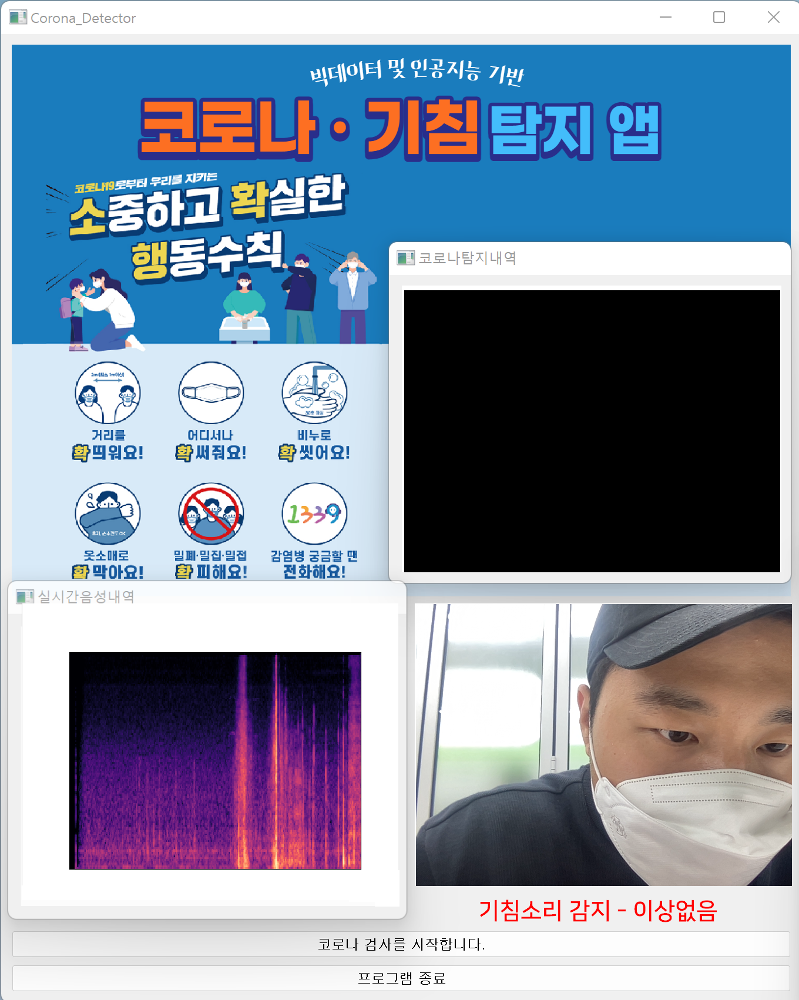

# Sesac_Project_COVID19_Cough_Recognition(Real-Time Application)

&nbsp;

&nbsp;
## 🎈 __목차__
1. Subject
    * 추진배경
    * 기대효과
2. Information
    * 음성데이터에 대하여
    * 추진과정
3. Datasets
    * 데이터 수집
    * 데이터 전처리
4. Modeling
    * 학습모델 선정
    * 모델 성능평가
5. Service
    * 프로토타입 구현
    * 애플리케이션 제작
6. Conclusion
    * 개선방향
    * 데모시현

   

&nbsp;
## 🎈 __Subject__
1. 추진배경
* 코로나19 재유행에 따라 기침소리를 이용해 실시간으로 감염여부를 판단하고자 함

 Covid19 일별 확진자 동향 : (출처 - Google News 검색)
 
 
 
2. 기대효과
* 감염자의 접근이 쉽고 폐쇄적인 공간인 엘리베이터에 활용하여 의심환자 발생 시 빠른 대응
   * 의심환자의 경우, 선별진료소 방문 등의 조치
   * 관리자의 경우, 의심환자 발생 공간(엛리베이터)에 방역 실시

 엘리베이터 감염 사례 : (출처 - 한국일보, New1, 인사이트)

      

   

&nbsp;
## 🎈 __Information__
1. 음성데이터에 대하여
* Melspectogram : 음성데이터의 주파수 단위를 멜 단위(Mel Unit)으로 바꾸어 표현한 스펙트럼

 Melspetogram 예시

* MFCC: 음성데이터를 특징 벡터화 해주는 알고리즘

 MFCC 예시
 
 
 
2. 추진과정
* 데이터 수집
   * 일반 기침소리, 코로나환자 기침소리 수집
* 데이터 전처리
   * Feature 추출 및 Spectogram 생성
   * SMOTE(Over Sampling)
* 기침 감지
   * 학습모델 생성 및 Binary Classfication(Cough)
* COVID19 분류
   * 학습모델 생성 및 Binary Classfication(COVID)
* 프로토타입 제작
* 
 COVID19 Cough Recognition Process
   
   
   
   
&nbsp;
## 🎈 __Datasets__
1. 데이터 수집
* 다양한 기침 및 코로나 데이터셋 수집, 기타 소리분류를 위한 추가 데이터셋 수집

 데이터셋 수집현황
 
 
 
2. 데이터 전처리
* SMOTE(Synthtic Minority Oversampling Technique)
   * 주제 특성상 양성데이터의 수가 적어 각각의 데이터 개수를 비슷하게 맞춰주기 위해 음성데이터는 Under sampling, 양성데이터는 Over sampling 진행

 데이터의 개수가 적은 클래스의  표본을 가져운 뒤, 임의로 추가하는 오버샘플링 방식

      

   

&nbsp;
## 🎈 __Modeling__
1. 학습모델 선정
* 데이터 선행처리 : 동일한 수준의 음성데이터 처리(5초) 
* Custom CNN을 통한 MFCC 데이터 분류
   * Zero crossing rate, rmse, spectral cetroid 등 총 46개의 feature 사용
* ResNet50을 통한 Melspectogram 이미지 분류   
   * CNN 구조를 가졌으며, 많은 layer를 활용하여 깊은 네트워크 구조를 가짐
   * Vanishing Gradient 문제를 해결하기 위해 Residual Block을 이용
   * 2015년 ILSVRC에서 우승한 알고리즘

 ResNet(2014) : MS에서 개발한 이미지 분류용 CNN 모델
 
* 과적합 방지를 위한 5-fold Cross Validation
 
 
 
2. 성능평가
* Custom CNN을 통한 MFCC 데이터 분류 : 정확도 60%
* ResNet50을 통한 Melspectogram 이미지 분류 : 정확도 55% ~ 60%
* MFCC, MelSpectrogram으로 추출한 feature를 활용해 그림을 모델에 적용 : 정확도 55% ~ 60%

 성능평가 수치

      

   

&nbsp;
## 🎈 __Service__
1. 프로토타입 구현
* 각종 라이브러리를 이용한 음성 및 영상 데이터 입력 
   * Pyaudio : 마이크를 통한 음성데이터 입력 및 사운드파일 저장
   * OpenCV : 웹캠을 통한 영상데이터 입력 및 이미지파일 저장
   * Librosa : 음성데이터의 특징 변수 추출
   * Torch : Pytorch를 활용한 학습모델 적용

 주요 라이브러리
 
 
 
2. 애플리케이션 제작
* PyQt5를 이용한 GUI 형태의 애플리케이션 구현
   * Qdesigner를 이용하여 전체적인 UI 디자인을 간단하게 진행 
   * Qthread를 이용하여 기본 앱에 실시간 입력 쓰레드의 효율적인 운영
   * Qdesigner를 이용하여 전체적인 UI 디자인을 간단하게 진행 
    * 기본 앱 (공지사항, 코로나 탐지결과 등)
    * 추가 윈도우창1 (실시간 음성 데이터 입력 및 처리 쓰레드 운영)
    * 추가 윈도우창2 (실시간 영상 데이터 입력 및 처리 쓰레드 운영)
* Pyinstaller를 이용한 실행파일 제작
   * Python 애플리케이션과 모든 종속 항목을 단일 패키지로 묶어 주는 라이브러리
   * Windows OS 기반 Python 미설치 환경에서도 운영가능하도록 exe 파일형태로 제작

 데모시현 장면

      

   

&nbsp;
## 🎈 __Conclusion__
1. 데모시현
* 주요기능
   * 실시간 음성데이터 학습모델 분석
   * 그래프 제공을 통한 기침 탐지 확인 
   * 영상 제공을 통한 코로나 탐지 확인

 
 
 
 
2. 개선방향
* 성능 향상
   * 데이터 변형 및 잡음 제거를 통한 데이터 구축
   * COVID19 분류 시 60% -> 80% 이상의 정확도 기대

* 활용도 확장
   * 다양한 환경에서 서비스 구축
   * 사용자 중심 UI 개선

 

      

 

   

      
      
